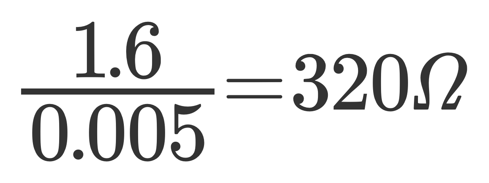
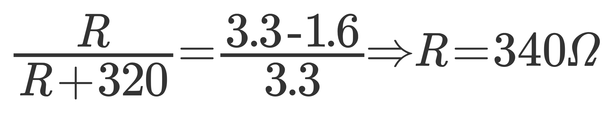
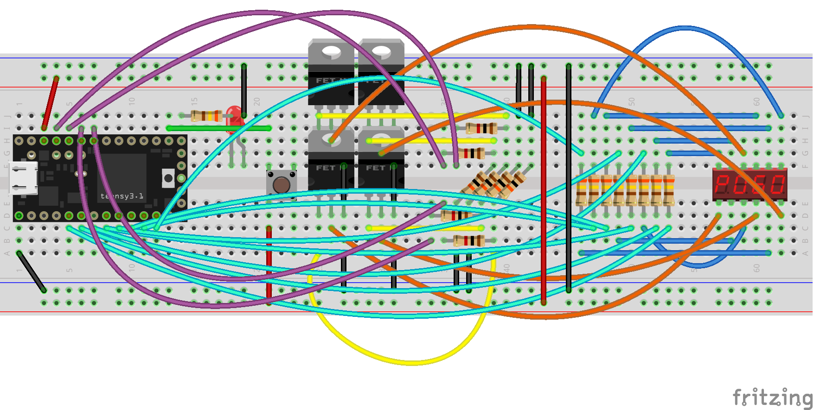
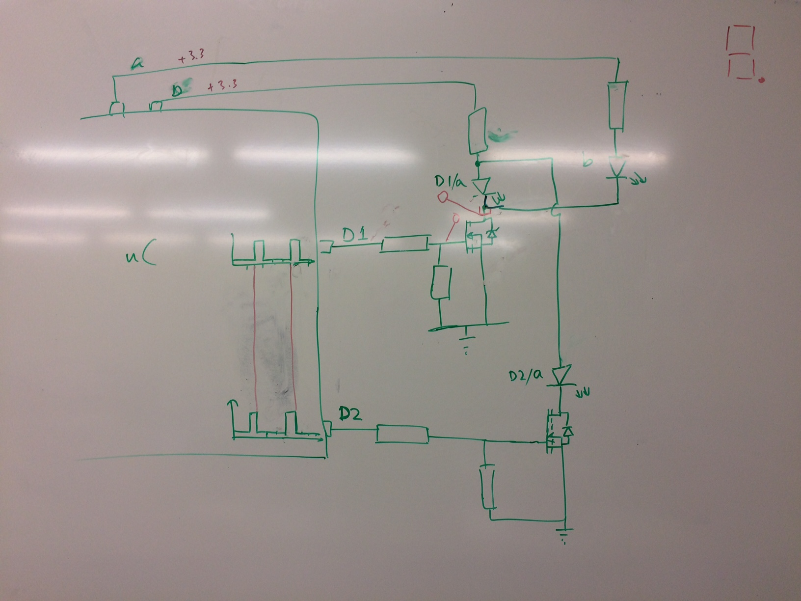
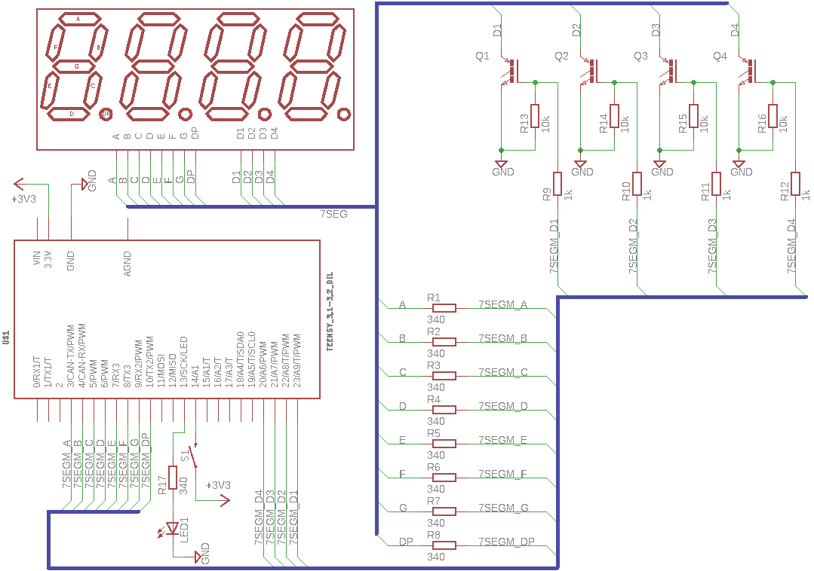
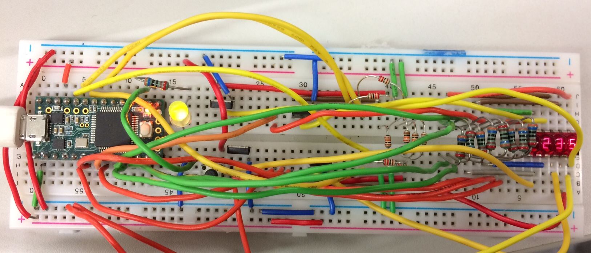
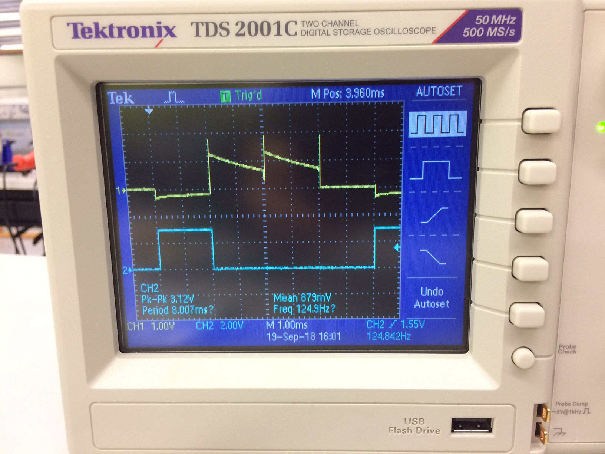

# weltec-reactiontester

Weltec MG7013 Project 1: Reaction Tester using a Teensy and a "bubble display" - 4-digit-7-segment display

* The system randomly activates an LED
* The user has to press a button as quickly as possible after the LED lights up
* The system will show the user's reaction time in milliseconds on the bubble display

## Usage
To run this project, build the circuitry shown below and power it via USB. The software was written using Arduino framework on VS Code with the PlatformIO extension. The easiest way to upload it to the Teensy is to open the software folder in VS Code and hit the upload button on Platform IO once the Teensy is plugged in via USB.

### Folder structure
The following file and folder structure has been used in this repository:

* datasheets - Relevant datasheets for this project
* electronics - The EAGLE and Fritzing schematics and image exports
* software - The microcontroller code as a PlatformIO project.
* media - Images for the README
* README.md - This file
* LICENSE - The re-use and re-distribution license

### Dependencies
All dependencies are defined in the platformio.ini file and managed by Platform IO. No external dependencies exist.

## Design / Assembly

Based on datasheet for the 4-digit-display, the maximum forward current per segment is 110mA. This exceeds the maximum pin current on the Teensy so we need to switch it separately. We achieve this with a MOSFET.

The forward voltage of each segment is typically 1.6V so we need to cut down our 3.3V supply voltage with a voltage divider. The resistance across the diode for it's specified average segment current of 5mA = 1.6/0.005 = 320 Ohm. 

Using this we can therefore use ratios to calculate the resistor we need. R/(R+320) = (3.3-1.6)/3.3 => R = 340 Ohm per segment.

Note that we're assuming we add resistors per segment rather than per digit. This is so that we have consistent brightness for a digit regardless of how many segments are lit.

### Components / BoM
| Supplier | Supplier Part # | # | Description            | MNF Part #    |
|:---------|:---------------:|---|:-----------------------|:--------------|
|          |                 | 1 | Teensy 3.2             |               |
|          |                 | 1 | LED                    |               |
|          |                 | 1 | 4-digit LED Display    | QDSP6064      |
|          |                 | 8 | 340 Ohm Resistor       |               |
|          |                 | 4 | 1k Ohm Resistor        |               |
|          |                 | 4 | 10k Ohm Resistor       |               |
|          |                 | 1 | N-Channel Power MOSFET | IRLU8743 IPAK |
|          |                 | 1 | Button                 |               |

Eagle component libraries for some of these components were sourced as follows:
* QDSP6064 - https://github.com/AustinHackers/ahabadge/tree/master/eagle%20libraries
* IRLU8743 - https://www.diymodules.org/eagle-show-library?type=usr&id=101529&part=IGBT.lbr
* Teensy - https://forum.pjrc.com/threads/24006-Eagle-library-for-MK20DX128VLH5?p=71944&viewfull=1#post71944
* Push button - https://github.com/sparkfun/SparkFun-Eagle-Libraries/blob/master/SparkFun-Switches.lbr

The library files can be found in the electronics folder.

### Electronics

The (somewhat difficult to decipher!) breadboard design can be seen below. The Fritzing file can be found in the electronics subfolder.

Note: Fritzing didn't include QDSP6064 out the box so I used the part available from: https://github.com/RichardBronosky/QDSP-6064

The schematic below shows an example for 2 segments and 2 digits wired up with the external MOSFETs for a complete circuit. In reality, the segments and digits are wired together with a common cathode internally to the seven segment display.

The schematic (Eagle model in the electronics directory), below, is the external wiring for the componentry.

It is worth noting the resistors:
* The 1k resistors are used as current limiting resistors to ensure the microcontroller isn't damaged by excessive current draw when the MOSFET is switched high. At that point it is entirely discharged so will potentially have a very high current draw.
* The 10k resistors are there to ensure that the MOSFET gate is pulled low to ensure that the gate is off.
* The 340 Ohm resistors, as mentioned previously, act as current limiting resistors for the segment LEDs. 

### Software
Of interest in the software is:
* **The switch debouncing** - we intentionally trigger on first interrupt and then lock out to ensure we know instantly when the user presses the button. We then measure the time from the moment the light is turned on to the first interrupt.
* **The Seven Segment library setup** - We use N-TRANSISTOR in the setup since we are using external MOSFETs to switch the digits on. This means that they need to be switched high, despite the fact that the segment LEDs share a common cathode.

## Results
The system works as expected.

An interesting side-effect of the seven segment library is that if the reaction time is longer than 9999 milliseconds, the library realises that this takes more than 4 digits and replaces the output with "`----`".

My reaction times to the rounded down to the nearest milliseconds on 5 successive tests came out as:

| Reaction Time / ms |
|--------------------|
| 231                |
| 181                |
| 189                |
| 255                |
| 204                |

While diagnosing a wiring problem a peculiar oscillogram was noticed at the cathode pin for the digits of the 7-segment-display. Channel 1, yellow, is the cathode pin, which corresponds to the drain on one of the MOSFETs. Channel 2, blue, is the gate for the same MOSFET as controlled by the microcontroller. Given more time it would be interesting to dig in to why it looks the way it does in more detail.

## Conclusions

This circuitry was over-engineered. Although MOSFETs and limiting resisters were used in this case, they were generally not needed since the currents running through this particular display unit were so low, however, this circuit can be used as is with much higher power display units with the MOSFETs in place. 

## References

**Note**: Some relevent datasheets can be found in the datasheets directory of this repository.

1. Hewlett Packard Components. (n.d.). QDSP-6064 4-DIGITS MICRO NUMERIC INDICATOR (7 Segment Monolithic). 
2. International Rectifier. (2007). IRLR8743PbF HEXFET Power MOSFET. 
3. PJRC. (2018, August 24). Teensy 3.2 & 3.1: New Features. Retrieved from pjrc.com: https://www.pjrc.com/teensy/teensy31.html#specs
