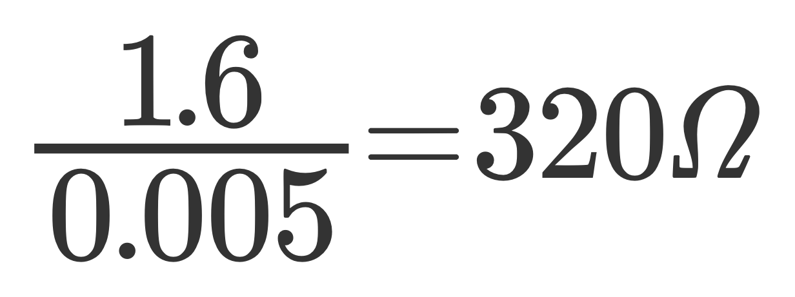
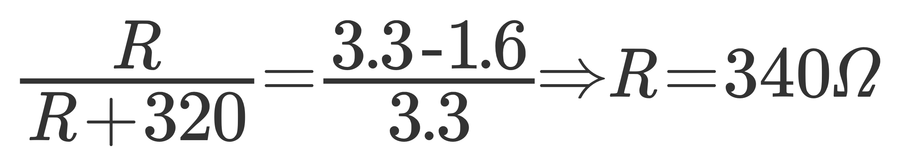
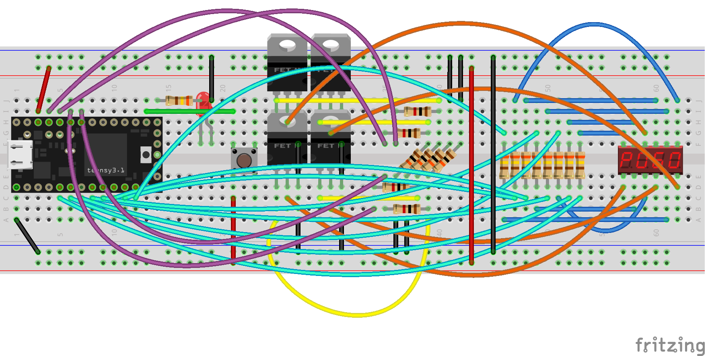

# weltec-reactiontester

Weltec MG7013 Project 1: Reaction Tester using a Teensy and a "bubble display" - 4-digit-7-segment display

* The system randomly activates an LED
* The user has to press a button as quickly as possible after the LED lights up
* The system will show the user's reaction time in milliseconds on the bubble display

## Design / Assembly

Based on datasheet for the 4-digit-display, the maximum forward current per segment is 110mA. This exceeds the maximum pin current on the Teensy so we need to switch it separately. We achieve this with a MOSFET.

The forward voltage of each segment is typically 1.6V so we need to cut down our 3.3V supply voltage with a voltage divider. The resistance across the diode for it's specified average segment current of 5mA = 1.6/0.005 = 320 Ohm. 

Using this we can therefore use ratios to calculate the resistor we need. R/(R+320) = (3.3-1.6)/3.3 => R = 340 Ohm per segment.

Note that we're assuming we add resistors per segment rather than per digit. This is so that we have consistent brightness for a digit regardless of how many segments are lit.

### Components / BoM
| Supplier | Supplier Part # | # | Description            | MNF Part #    |
|:---------|:---------------:|---|:-----------------------|:--------------|
|          |                 | 1 | Teensy 3.2             |               |
|          |                 | 1 | LED                    |               |
|          |                 | 1 | 4-digit LED Display    | QDSP6064      |
|          |                 | 8 | 340 Ohm Resistor       |               |
|          |                 | 4 | 1k Ohm Resistor        |               |
|          |                 | 4 | 10k Ohm Resistor       |               |
|          |                 | 1 | N-Channel Power MOSFET | IRLU8743 IPAK |
|          |                 | 1 | Button                 |               |

### Electronics

The (somewhat difficult to decipher!) breadboard design can be seen below.

Note: Fritzing didn't include QDSP6064 out the box so I used the part available from: https://github.com/RichardBronosky/QDSP-6064

The schematic, below, is more useful for understanding how the circuit actually fits together. 

### Software
